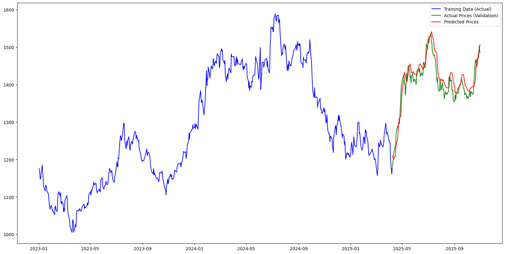
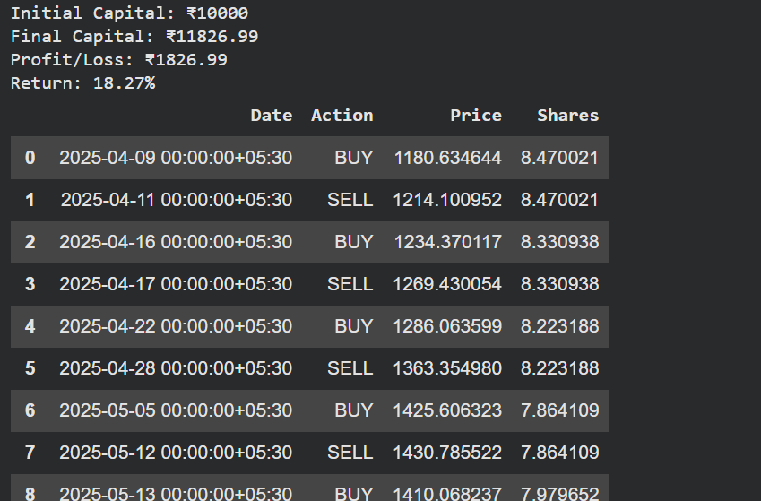
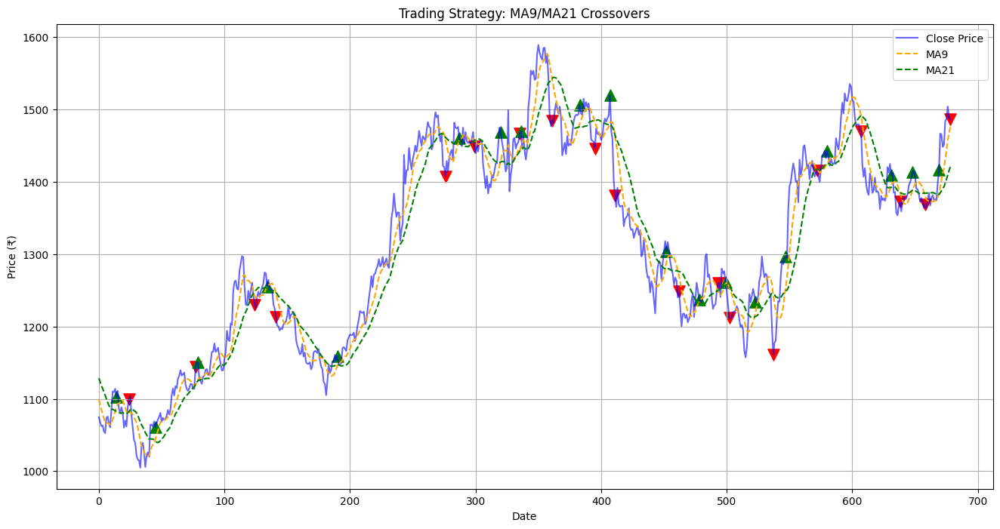
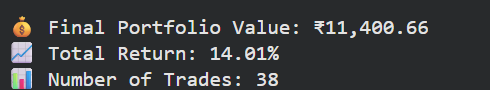
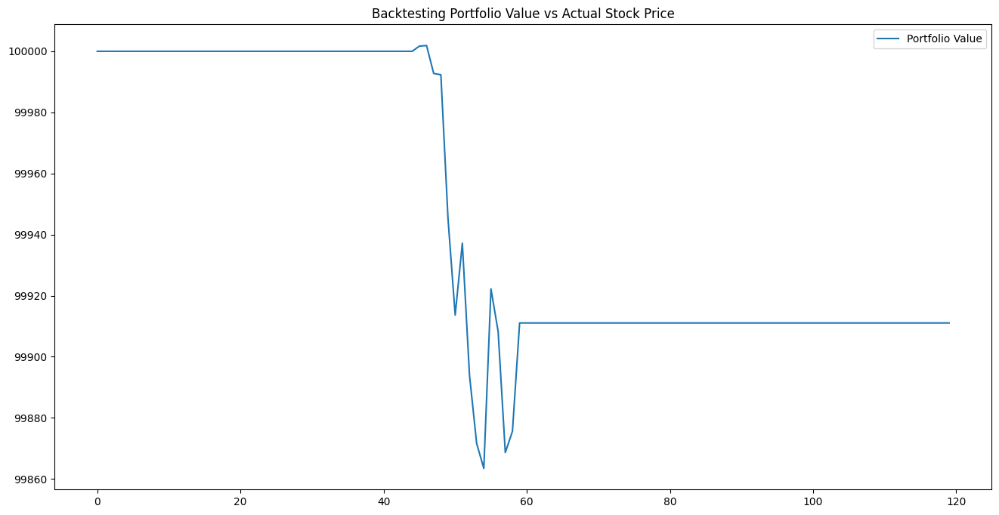

# 📊 Stock ML Insights Report

A machine learning project analyzing **RELIANCE.NS** stock data using multiple models and trading strategies, including **LSTM**, **Moving Average Crossover**, and **Technical Indicators** such as **RSI**, **MACD**, and **Bollinger Bands**.

---

## 🚀 Project Overview

This project explores how data science and machine learning can be applied to stock market analysis.  
It evaluates different approaches for **predicting next-day stock prices**, **identifying trends**, and **testing trading strategies**.

The analysis includes:
1. 📈 **LSTM-based next-day stock price prediction**
2. ⚙️ **Moving Average (MA) crossover trading strategy**
3. 🤖 **Machine Learning model trained on Technical Indicators**

---

## 📂 Files 

| File | Description |
|------|--------------|
| `stockMLinsightsreport.ipynb` | Main Jupyter Notebook containing code, analysis, and visualizations |
| `/images/` | Saved charts and graphs for documentation |

---

## 🧠 Tech Stack

- **Python**
- **Pandas**, **NumPy**, **Matplotlib**, **Seaborn**
- **Scikit-learn**
- **TensorFlow / Keras**
- **yFinance**

---

## ⚙️ How to Run

1. Clone the repository:
   ```bash
   git clone https://github.com/your-username/Stock-ML-Insights.git
   cd Stock-ML-Insights

## 📸 Output Visualizations

### 🧠 LSTM Predicted vs Actual Prices




### ⚙️ Moving Average Crossover Strategy





### 📊 Model Comparison

